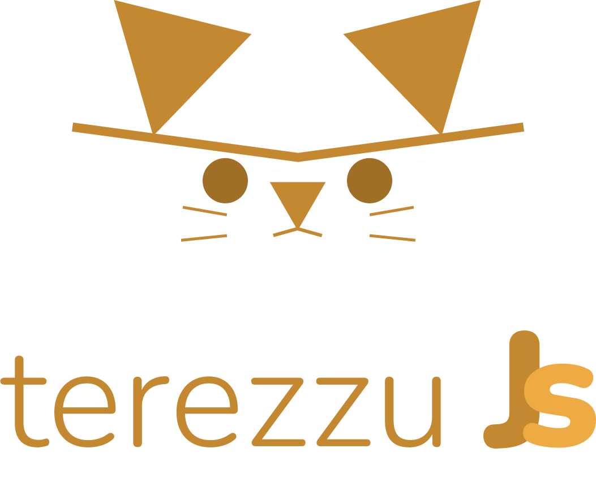

### O Template 

Esse é um template da biblioteca [TerezzuJS](https://github.com/to-codando/terezzujs) e você pode usá-lo para criar seus projetos.

### A biblioteca

O Terezzu foi criado com o intuito de manter a sanidade enquanto programando sistemas. Portanto,
não espere que haja coisas complicadas aqui.

### Os Comandos

Para clonar o repo e iniciar um novo projeto

```
  npx degit github:to-codando/terezzujs-template
```

Para instalar as dependências do projeto

```
  pnpm i
```

Para executar o projeto

```
  pnpm start
```